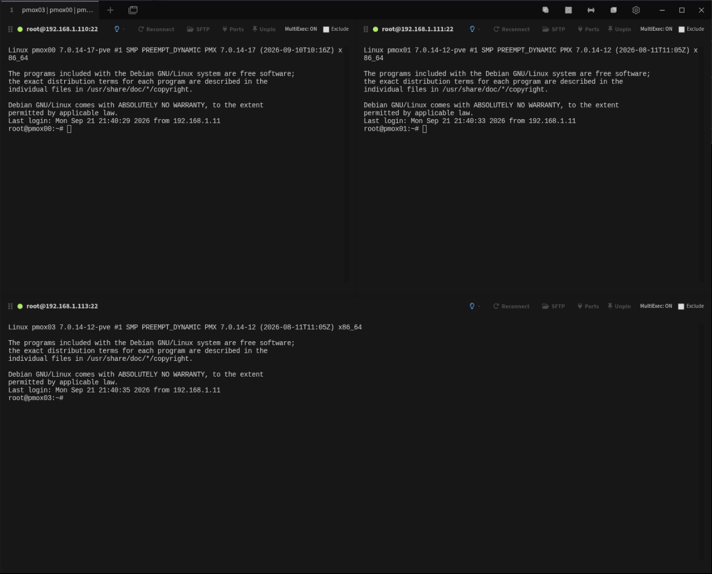
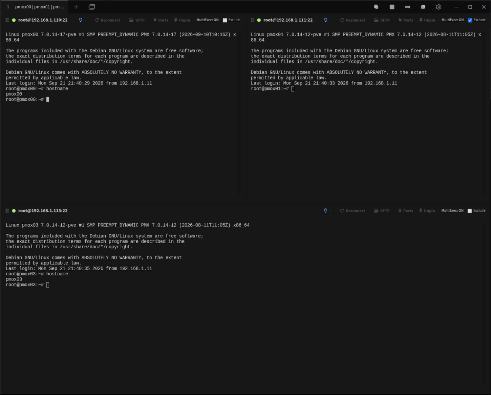
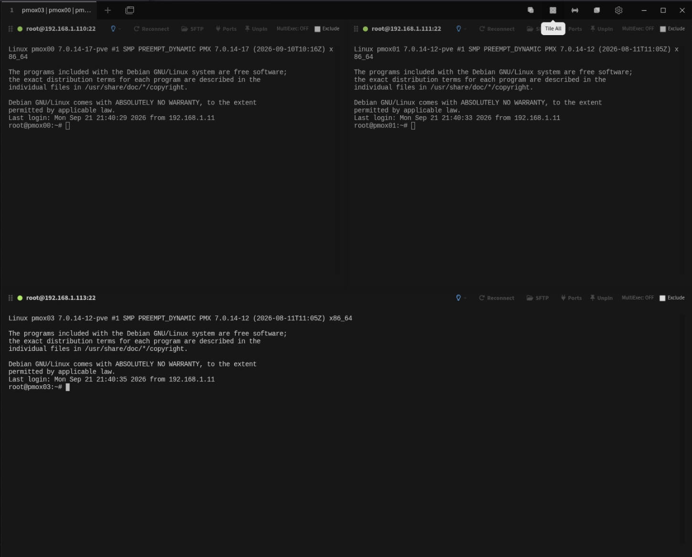
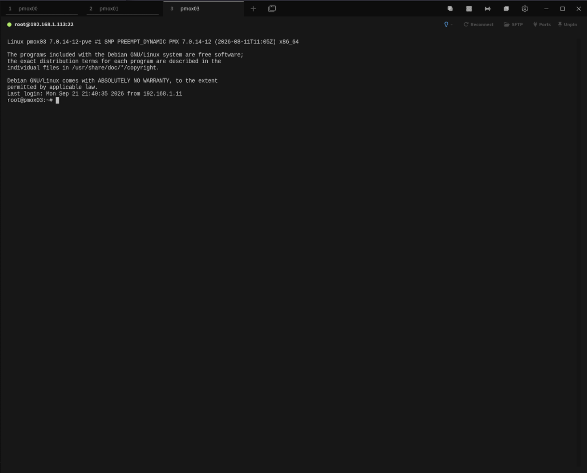
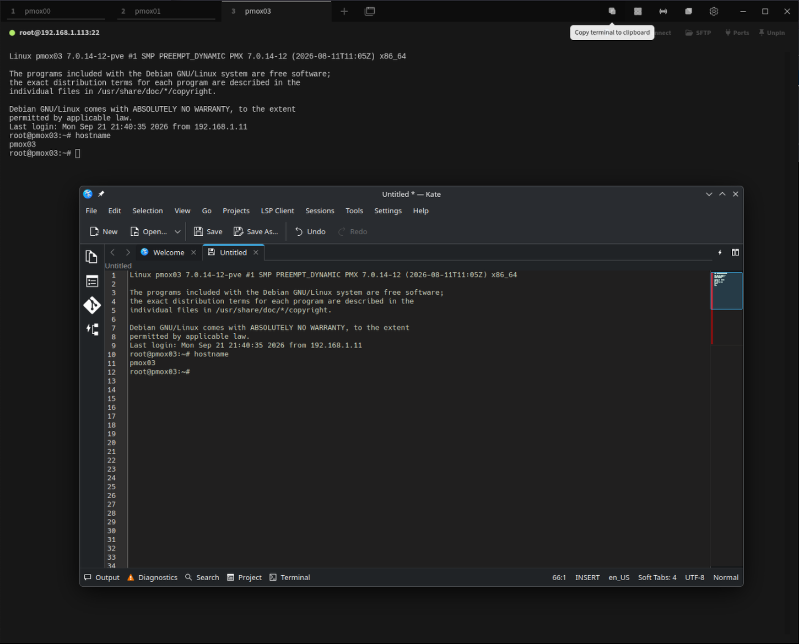

# Tabby MultiExec

Persistent, selective MultiExec for the Tabby terminal.

Tabby MultiExec extends Tabby's tiled-terminal workflow with persistent
broadcast input, dynamic per-terminal exclusions, layout controls, and
one-click copying of the active terminal buffer.

**Project website:** https://pttsllc.com/projects/tabby-multiexec/

## Features

- Persistent MultiExec mode
- MultiExec stays enabled when changing the focused terminal
- Dynamic per-pane **Exclude** control
- Exclusions can be changed while MultiExec is running
- MultiExec automatically tiles open sessions when needed
- Tile sessions without enabling MultiExec
- Disable MultiExec while remaining in tiled view
- Return tiled sessions to their original tab order
- Explicit MultiExec ON/OFF state in every pane
- One-click copy of the focused terminal's complete scrollback
- Compact toolbar controls with hover descriptions
- No external service or server required

## Screenshots

### Persistent MultiExec

MultiExec automatically tiles open sessions and keeps broadcast input active
while you move between terminal panes.

### Dynamic pane exclusion

Individual terminals can be excluded from broadcast input while MultiExec
remains active.

### Tiled sessions without broadcast

Tile your sessions for visibility without enabling MultiExec.

### Normal tabbed workflow

Return the tiled sessions to their original tab order at any time.

### Copy complete terminal scrollback

The Copy control places the complete scrollback of the focused terminal onto
the system clipboard.

## Installation

Open Tabby and navigate to:

**Settings → Plugins**

Locate:

`multiexec`

and install it.

The npm package is:

`tabby-multiexec`

### Current Tabby plugin-search issue

Some current Tabby releases have a broken or unreliable plugin search box.

If searching for `multiexec` returns nothing, scroll through the plugin list
until you find **multiexec**.

## Basic workflow

### MultiExec

With several terminal sessions open:

1. Click the **MultiExec** toolbar control.
2. Sessions are tiled automatically.
3. Keyboard input is broadcast to all included terminals.
4. Clicking another terminal changes the active/source terminal without
   disabling MultiExec.
5. Click MultiExec again to stop broadcasting while keeping the tiled view.

### Excluding a terminal

Each tiled terminal has an **Exclude** checkbox.

Checking Exclude immediately removes that terminal from broadcast output.

The checkbox can be changed dynamically while MultiExec remains active.

### Tile without MultiExec

Use the **Tile** toolbar control to display all sessions together without
broadcasting input.

### Return to tabs

Use the **Tabs** toolbar control to return the tiled terminals to their
original tab order.

### Copy terminal

The **Copy** toolbar control copies the complete scrollback of the currently
focused terminal to the system clipboard.

## Compatibility

Initial release tested with:

- Tabby 1.0.235
- Linux / Kubuntu
- X11/XWayland-hosted Tabby

Other operating systems and Tabby versions may work but have not yet been
formally validated.

## Package

npm:

https://www.npmjs.com/package/tabby-multiexec

Current release:

**1.0.3 — September 23, 2026**

Release history and patch notes:

[CHANGELOG.md](CHANGELOG.md)

## Issues and feature requests

Use the GitHub Issues section of this repository for:

- bug reports
- compatibility reports
- enhancement requests
- workflow suggestions

Please include your Tabby version and operating system when reporting a bug.

## Author

**Neil Proctor**

Developer identity: `nproctor-dev`

## Acknowledgments

Tabby MultiExec was created by Neil Proctor with development and design
assistance from ChatGPT by OpenAI.

## Source

The distributed npm package contains compiled plugin code.

The development source repository is private.

## License

Tabby MultiExec is free for personal, educational, and internal commercial use.

See `LICENSE.txt` for the complete license terms.
